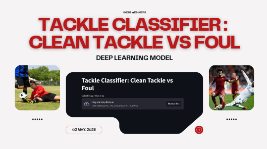
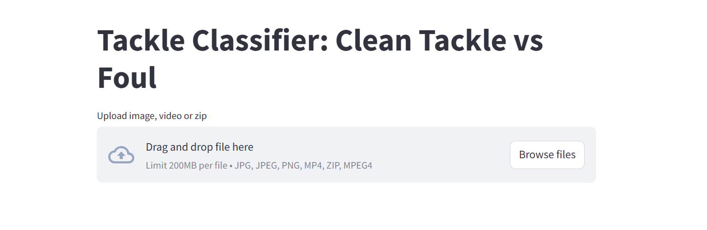

# Tackle Classifier – Clean vs Foul

This project focuses on classifying football tackles from videos or images into two categories: `clean_tackle` and `foul`, using a deep learning model.

---

## 🚀 Presentation

Click the image to view the presentation.

---

## 🚀 Features

✅ **Image Classification** – Upload images of tackles and get instant predictions.  
✅ **Video Frame Labeling** – Upload videos; the app detects significant movements and labels frames with color-coded borders.  
✅ **Batch Processing** – Upload ZIP files of images for bulk predictions.  
✅ **Downloadable Outputs** – Easily download processed images and videos.

---

## 🔧 Technologies Used

- **Deep Learning**: MobileNetV2 fine-tuned on the dataset
- **Libraries**: TensorFlow/Keras, OpenCV, PIL, NumPy
- **Web App**: Streamlit

---

## 📦 Dataset

We used the [Football Tackles Dataset](https://www.kaggle.com/datasets/zaikali/football-tackles) from Kaggle, which contains labeled images for `clean_tackle` and `foul` classes.

---

## 🖥️ Web App

Click the image to launch the app.

---

## 🤝 Contributing

Pull requests are welcome! Feel free to open issues for suggestions or bug fixes.

---

## 💡 Future Improvements

- Support for additional tackle scenarios (e.g., slide tackle, header challenge)
- Enhanced video analysis for smoother frame transitions

---

## 📜 License

This project is open-source and available under the [MIT License](LICENSE).

---

## 🙏 Acknowledgments

- Kaggle dataset contributors
- OpenCV and Streamlit communities

---

Happy coding! ⚽
