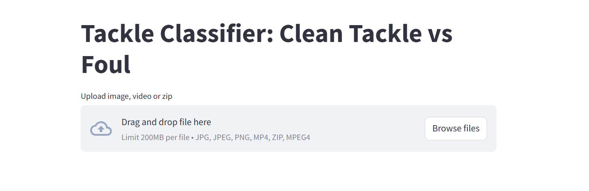

# Tackle Classifier – Clean vs Foul

This project focuses on classifying football tackles from videos or images into two categories: `clean_tackle` and `foul`, using a deep learning model.

 <!-- adjust path if needed -->

---

## 🚀 Features

✅ **Image Classification** – Upload images of tackles and get instant predictions.  
✅ **Video Frame Labeling** – Upload videos; the app detects significant movements and labels frames with color-coded borders.  
✅ **Batch Processing** – Upload ZIP files of images for bulk predictions.  
✅ **Downloadable Outputs** – Easily download processed images and videos.

---

## 🔧 Technologies Used

- **Deep Learning**: MobileNetV2 fine-tuned on the dataset
- **Libraries**: TensorFlow/Keras, OpenCV, PIL, NumPy
- **Web App**: Streamlit

---

## 📦 Dataset

We used the [Football Tackles Dataset](https://www.kaggle.com/datasets/zaikali/football-tackles) from Kaggle, which contains labeled images for `clean_tackle` and `foul` classes.

---

## 🖥️ Usage

1. **Clone the repository:**
    ```bash
    git clone https://github.com/mzzhub/tackle-classifier.git
    cd tackle-classifier
    ```

2. **Install dependencies:**
    ```bash
    pip install -r requirements.txt
    ```

3. **Run the app:**
    ```bash
    streamlit run app.py
    ```

4. **Access the web interface** in your browser at `http://localhost:8501`.

---

## 🛠️ Project Structure

├── app.py # Main Streamlit app
├── mobilenetv2_hyper_tuned_model.h5 # Pre-trained model
├── utils.py # (Optional) Helper functions
├── screenshots/ # Demo screenshots
└── README.md # Project overview


---

## 🤝 Contributing

Pull requests are welcome! Feel free to open issues for suggestions or bug fixes.

---

## 💡 Future Improvements

- Support for additional tackle scenarios (e.g., slide tackle, header challenge)
- Enhanced video analysis for smoother frame transitions
- Deployment on cloud platforms (AWS/GCP/Azure)

---

## 📜 License

This project is open-source and available under the [MIT License](LICENSE).

---

## 🙏 Acknowledgments

- Kaggle dataset contributors
- OpenCV and Streamlit communities

---

> **Note:** Model file (`mobilenetv2_hyper_tuned_model.h5`) is large and may need to be downloaded separately if not included in this repository.

---

📬 For queries, reach out at [Your Email/LinkedIn].

---

Happy coding! ⚽
